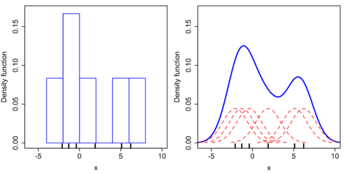
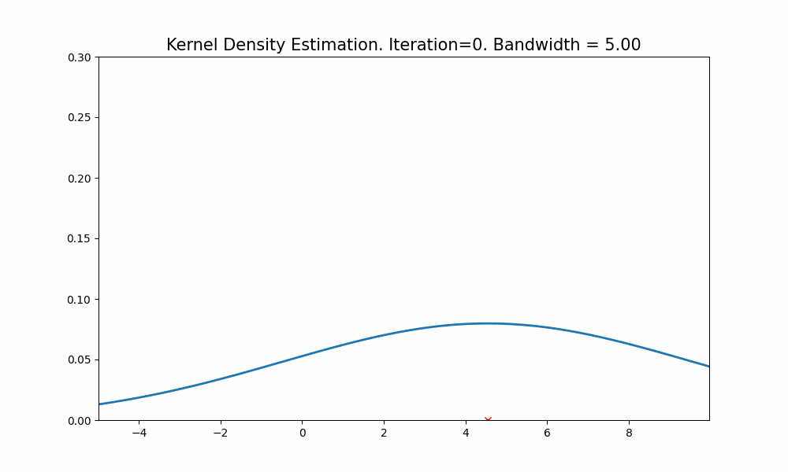
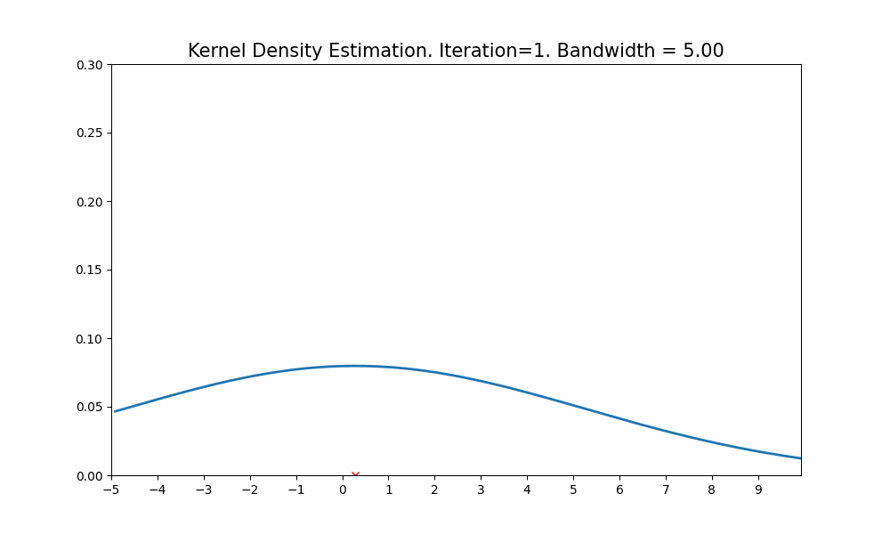
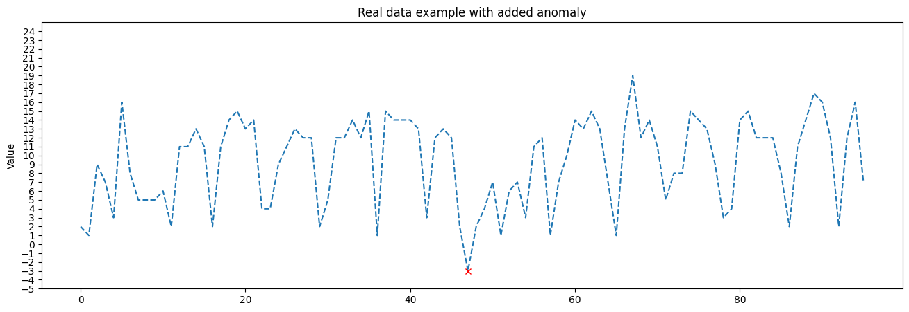
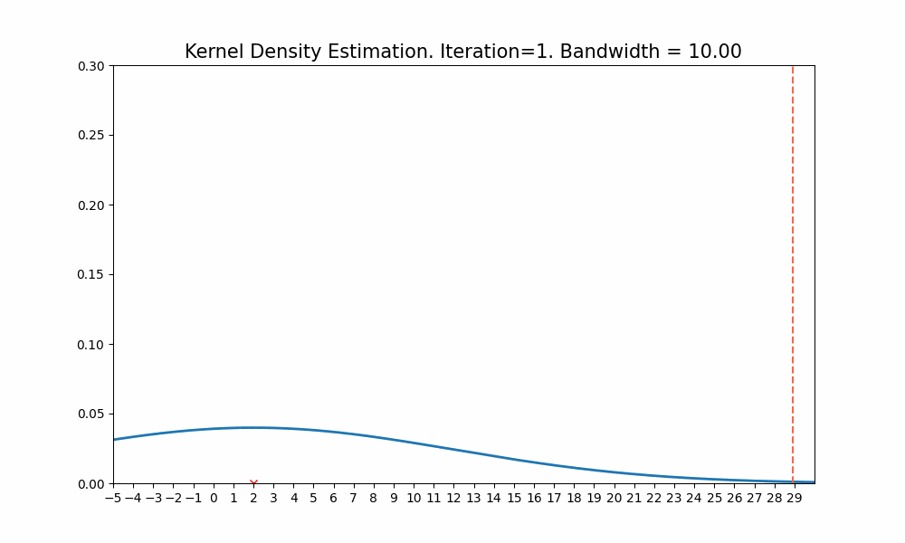
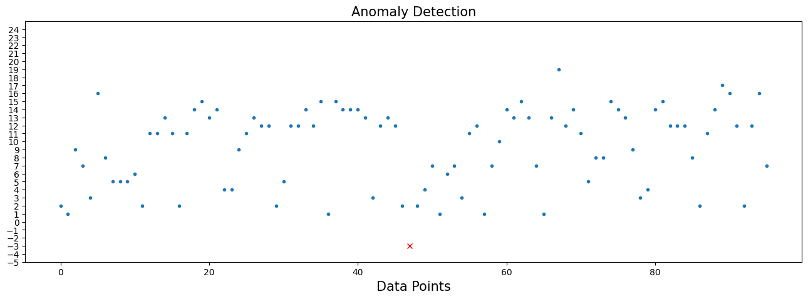

## Time-Series Anomalies Detection with KDE (Kernel Density Estimate) and MCMC Metropolis-Husting: Bridging the Gap in Anomaly Detection

---
### Introduction
Anomaly detection, an integral part of time-series data analysis, aims to identify outliers that deviate significantly from the norm. Traditional methods, like the Z-score approach, offer valuable insights into anomaly detection. However, they primarily perform optimally with data conforming to a normal distribution. In the real world, we often come across data exhibiting non-normal distribution patterns, limiting the efficacy of these traditional methods. This article outlines an innovative approach for anomaly detection in time-series data that leverages Kernel Density Estimation (KDE) and Markov Chain Monte Carlo (MCMC) Metropolis-Hustings algorithm, enabling the handling of arbitrary distributions.

---
### Bridging the Gap with KDE and MCMC Metropolis-Husting

The foundational idea behind this approach is to harness the power of KDE to emulate the random variable distribution in real time. KDE is a non-parametric way to estimate the probability density function of a random variable. It allows us to avoid making assumptions about the data's distribution, providing a flexible methodology to model the distribution of arbitrary datasets.

With this kernel density estimate in hand, we can compute an analogue of the Z-score for any distribution. Here, the Z-score is not calculated using the standard deviation and mean (as in a normal distribution), but instead is derived from the probability density function estimated by the KDE.

Imagine you have a histogram of your data. Instead of seeing individual bars, the KDE will create a smooth curve that passes over the top of these bars, effectively smoothing out the randomness and revealing the underlying distribution. This makes KDE a fantastic tool for understanding the underlying structure of the data, especially when the distribution is unknown or does not fit well with traditional parametric distributions.

However, the challenge lies in how to calculate this KDE-based Z-score. This is where the MCMC Metropolis-Husting algorithm comes in. The Metropolis-Husting algorithm is a specific case of the MCMC method, widely used in statistics for sampling from complex probability distributions, especially when they cannot be calculated directly. By integrating the Metropolis-Husting algorithm with KDE, we can efficiently calculate the Z-score values for arbitrary distributions, bridging the gap in anomaly detection for non-normal data.

---
### The Mechanics of the Approach
For each new observation in a time-series dataset, we use KDE to update our understanding of the data distribution. We operate with a sliding window of recent data, continually adapting to shifts in the data's behavior over time. This flexibility leads to an adaptable and resilient anomaly detection system.

An essential adjustment we make here is the reduction of the KDE's bandwidth for each new data point. The bandwidth in KDE is a smoothing parameter that determines the width of the kernel and, thus, affects the estimate's bias and variance. By reducing the bandwidth, we create a narrower and more peaked distribution that is more sensitive to new observations. This modification allows us to detect anomalies that may have been smoothed over by a broader bandwidth.

After updating the KDE and adjusting the bandwidth, we calculate the probability density of the new observation under our adjusted distribution. This density value serves as our "Z-score" for the new observation. However, instead of representing how many standard deviations an observation is from the mean, it signifies how probable the observed data point is under the current estimated distribution.

Finally, we utilize the MCMC Metropolis-Husting algorithm to perform this probability density calculation. Using a proposal distribution, the algorithm generates candidate samples and decides whether to accept or reject these samples based on their likelihood under the current KDE. By drawing many samples and seeing where they land, we can estimate the integral of the KDE over any range. This estimation process enables us to calculate the "Z-score" of a new observation, thereby enabling the detection of anomalies even in complex, non-normally distributed datasets.

---
### Real-World Example Visualized

Real world time-series:

Process of finding anomaly:

Plotting anomaly points:

---
### Conclusion
Time-series anomaly detection plays a crucial role in many industries, from finance to healthcare, security, and beyond. While traditional methods like Z-score have their merits, they fall short when dealing with non-normally distributed data. By leveraging the power of KDE and MCMC Metropolis-Husting, we can create a robust anomaly detection system capable of handling arbitrary distributions, extending the frontier of our analytic capabilities.

However, there are several enhancements that can be made to further improve this approach:

 * Add functionality of multivariate KDE and Metropolis-Hastings: The current approach is focused on univariate data. It would be beneficial to extend the methodology to multivariate data, which is a common occurrence in real-world datasets.

 * Develop a smarter way of density function estimation for a large number of points: With increasing data size, the computational cost of the current approach can be substantial. Developing a more efficient approach to estimate the density function could make this method more scalable and applicable to large datasets.

 * Automate the process of bandwidth selection: Currently, the bandwidth selection is a manual process and plays a vital role in the quality of the KDE. Developing an automatic or adaptive method for bandwidth selection can help make the method more robust and easier to use.

 * Check for anomalies not just in the tails but also in the middle of the distribution: The current approach might miss anomalies that are not extreme enough to fall into the tails of the distribution. Therefore, a method that can also detect anomalies within the body of the distribution will be more comprehensive.